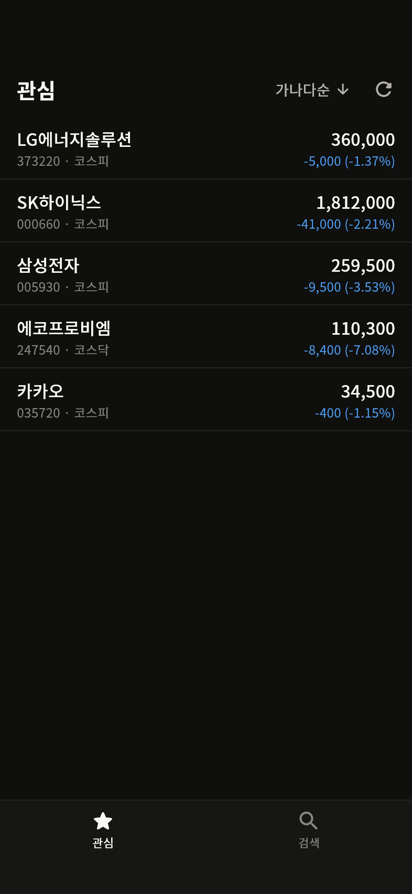
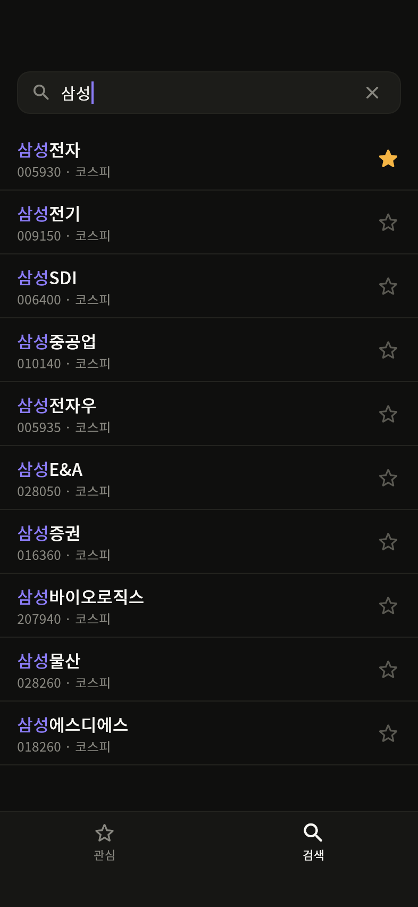
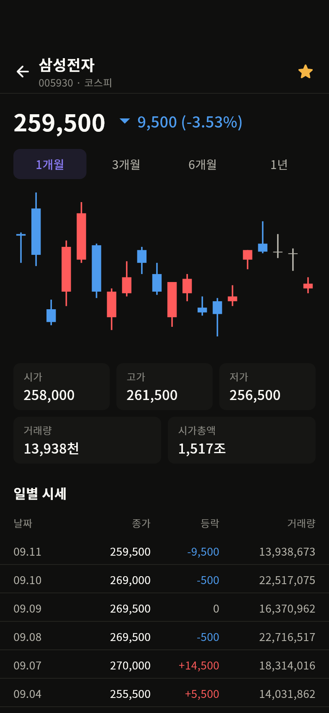

# 국내 주식 관심종목 앱

이든크루 Flutter 신입 개발자 과제(과제 1) 구현물입니다.
관심종목 목록 · 종목 검색 · 종목 상세 세 화면을 Naver 데이터와 연결해 구현했습니다.

| 관심 | 검색 | 상세 |
| --- | --- | --- |
|  |  |  |

> 위 이미지는 `test/screens_golden_test.dart`가 시안과 같은 크기(393 × 852, 상태 표시줄 · 홈
> 인디케이터 포함)로 각 화면을 그려 저장한 것입니다. 숫자는 `assets/mock/`에 저장해 둔
> 실제 응답을 파싱해서 나온 값입니다.

> **과제 2(Lucy Studio)도 이 저장소에 함께 올려 두었습니다.** → [`task2-lucy/`](task2-lucy/)
> 메일에 첨부하려 했으나 Gmail이 zip 내부의 `assets/script/common.js`(Lucy 프로젝트
> 템플릿 파일)를 이유로 첨부를 차단해서, 동일한 zip을 저장소에 두었습니다.

---

## 이 과제를 진행한 방식

**Flutter로 앱을 만든 것은 이번이 처음입니다.** 그동안은 웹 프론트엔드(JavaScript ·
React · Vue)를 주로 다뤄왔습니다. 그래서 Dart 문법이나 위젯 사용법은 공식 문서와
AI 도구의 도움을 받았습니다.

대신 **선택지를 좁히는 판단은 직접 하려고 했습니다.** 진행 방식은 이랬습니다.

1. 결정이 필요한 지점마다 후보를 2~3개 놓고 비교했습니다.
   (예: 상태관리 — Provider / Riverpod / Bloc)
2. 이 과제의 요구사항에 비춰 무엇이 유리한지를 기준으로 골랐습니다.
3. 고른 뒤에는 **그 결정이 실제로 의도대로 동작하는지 테스트로 확인**했습니다.
   페이지 재사용과 관심 상태 동기화가 그런 경우입니다.

아래 `기술 선택과 이유`와 `직접 판단한 부분`은 그 과정에서 나온 결론입니다.
비교한 대안도 함께 적어 두었습니다.

### 익숙한 것에 대입해서 이해했습니다

Dart와 Flutter가 모두 처음이라, 새 개념을 만날 때마다 **웹에서 쓰던 것에 대응시켜
보면서** 이해했습니다. 그렇게 정리한 대응이 이 정도입니다.

| Flutter / Riverpod | 웹에서 쓰던 것 |
| --- | --- |
| Widget | 컴포넌트 |
| `StatefulWidget` + `setState` | `useState` |
| `build()` | 렌더 함수 |
| `Column` / `Row` | `flex-direction: column / row` |
| `Expanded` / `Flexible` | `flex: 1` |
| `Provider` | Zustand 스토어 · Context |
| `ref.watch(p)` | `useStore(selector)` — 구독 |
| `ref.read(p)` | `getState()` — 구독 없이 값만 |
| `p.select(fn)` | `useStore(s => s.x)` |
| `FutureProvider` | `useQuery` |
| `.family(arg)` | `queryKey: [key, arg]` |
| `AsyncValue` | `{ isLoading, error, data }` |
| `ref.invalidate(p)` | `queryClient.invalidateQueries()` |
| `Future` / `async` · `await` | `Promise` / `async` · `await` (거의 그대로) |
| `CustomPainter` | `<canvas>` 2D 컨텍스트 |

이 대응이 전부 들어맞지는 않았습니다. 두 가지가 특히 그랬습니다.

- **`BuildContext`** — 딱 맞는 짝이 없어서 따로 이해해야 했습니다. 위젯 트리에서 "내
  위치"를 가리키는 핸들이고, `Theme.of(context)`가 위쪽으로 올라가며 테마를 찾는
  방식이 `useContext`와 비슷하다는 선에서 잡았습니다.
- **위젯 재생성** — React에서는 리렌더를 아끼려고 `memo`를 신경 쓰는데, Flutter는
  위젯 재생성 자체가 가볍게 설계돼 있어서 감각이 달랐습니다. 대신 `const` 생성자로
  "이건 안 바뀐다"고 알려주는 방식을 쓰게 됐습니다.

그래도 이 대응 덕분에 라이브러리를 고르거나 구조를 잡을 때 **완전히 감으로 정하지는
않을 수 있었습니다.** 웹에서 쓰던 개념과 대응되는 부분은 아래 설명에도 함께 적어
두었습니다.

---

## 실행 방법

```bash
flutter pub get
flutter run
```

- **Flutter 3.41.7 (stable) / Dart 3.11.5** 에서 작업했습니다.
- **웹(Chrome)에서는 동작하지 않습니다.** Naver endpoint가 CORS를 허용하지 않습니다.
  실행 대상을 모바일 기기나 에뮬레이터로 바꿔 주세요.
- 시안 기준 크기는 `393 × 852` 입니다.

### 확인한 범위

| 확인한 것 | 방법 |
| --- | --- |
| 화면 렌더링 (6개 상태) | 위젯 테스트에서 393 × 852로 그려 시안 프레임과 대조 (`test/goldens/`) |
| 화면 간 관심 상태 동기화 | 위젯 테스트에서 검색 → 관심 → 상세를 실제로 오가며 확인 |
| Naver endpoint 4종 연동 | 실제 endpoint에 요청해 파싱 결과까지 확인 |
| 정적 분석 | `flutter analyze` — 이슈 없음 |
| 테스트 | `flutter test` — **32개 통과** (골든 8개는 아래 사유로 skip) |

### 폰트

저장소가 제공한 방식을 **그대로 두었습니다.** `assets/fonts/`의 Noto Sans KR 세 굵기와
`pubspec.yaml` 등록, `AppTheme.dark`의 기본 서체 설정을 바꾸지 않았습니다.

다만 테스트에서는 폰트를 직접 등록합니다. `flutter_tester`는 기본적으로 asset 폰트를 끄기
때문에, 그대로 두면 글자 폭과 줄바꿈이 실제와 달라져 시안과 비교할 수 없습니다.
(`test/support/test_harness.dart`의 `loadAppFonts`)

---

## 구현 범위

### 필수 — 모두 구현했습니다

**관심 화면**
- 종목명 / `종목코드 · 시장` / 현재가 / `등락액 (등락률)`
- 상승 · 하락 · 보합 3색 처리 (상승 빨강, 하락 파랑)
- 상단 새로고침
- 하단 탭 바 (`navActive` / `navInactive`)
- 시세 미수신 행 스켈레톤 (`feedbackSkeleton`)
- 빈 상태 (헤더 · 탭 바 유지)
- 정렬 — 헤더 칩 · 바텀시트 · 체크 표시 · 즉시 반영

**검색 화면**
- 입력창과 지우기 버튼
- 검색어 하이라이트 (`searchHighlight`)
- 관심 등록 / 해제 버튼 (`favoriteActive` / `favoriteInactive`)
- 등록 · 해제 토스트 (아이콘 + 문구)
- 행 탭 → 상세 이동
- 검색 전 빈 상태 / 검색 결과 없음 빈 상태 (검색어 포함)

**상세 화면**
- 뒤로 가기 · 종목명 · `종목코드 · 시장` · 관심 등록
- 현재가와 등락 (방향 아이콘 ▲ / ▼)
- 기간 탭 4종 동작 (`accentDefault` / `accentBg`)
- 캔들 차트 (`chartLineUp` / `chartLineDown`)
- 요약 카드 5종 (거래량 · 시가총액 축약)
- 일별 시세 표 (`MM.DD`, 부호와 색)

**상태 동기화**
- 세 화면의 별 아이콘이 함께 바뀝니다
- 검색 직후에도 현재 관심 상태가 반영됩니다
- 검색에서 등록한 종목이 관심 목록에 들어오고, 상세에서 해제하면 목록에서도 빠집니다

### 추가로 구현한 선택 항목

- 관심 목록 로컬 저장 (앱을 다시 켜도 유지)
- 정렬 기준 로컬 저장
- Pull to refresh
- 관심종목 스와이프 삭제
- 검색 입력 디바운스 (300ms)
- 검색 중 로딩 표시
- 토스트 등장 / 퇴장 애니메이션

### 구현하지 않은 선택 항목

- 최근 검색어
- 차트 축 라벨 · 거래량 바 · 영역 채우기 · 크로스헤어 · 전환 애니메이션
  (시안의 차트에 축 라벨과 거래량 바가 없어서, 시안에 없는 요소를 더하기보다
  시안대로 캔들만 그렸습니다. `chartAxisLabel` · `chartVolumeBar` 토큰은 쓰지 않았습니다.)
- 일별 시세 표 무한 스크롤 (기간 탭이 거래일 수를 정하므로 필요하지 않았습니다)

### 테스트

```bash
flutter test
```

```
00:02 +32 ~8: All tests passed!
```

| 파일 | 확인하는 것 |
| --- | --- |
| `sise_day_parser_test.dart` | 저장해 둔 실제 HTML로 표 파싱 · 전일비 부호 · `lastPage` |
| `daily_price_cache_test.dart` | 기간 탭을 바꿀 때 **실제로 요청한 페이지 번호**를 세어 재사용 확인 |
| `favorite_sync_test.dart` | 검색 → 관심 → 상세를 오가며 관심 상태가 함께 바뀌는지 |
| `formatters_test.dart` | 시안의 표기 형식 (`-400 (-0.22%)`, `29,113천`, `1,063조`) |
| `watchlist_sort_test.dart` | 정렬 규칙과 시세 미수신 행의 위치 |
| `screens_golden_test.dart` | 시안 대조용 화면 이미지 생성 (**기본 skip**) |

골든 테스트는 글자 래스터라이즈가 OS와 폰트 버전에 따라 조금씩 달라져, 다른 환경에서
`flutter test`가 실패하는 것을 막으려고 기본적으로 건너뜁니다. 이미지를 다시 만들려면:

```bash
flutter test --dart-define=GOLDEN=true --update-goldens test/screens_golden_test.dart
```

---

## 폴더 구조

```text
lib/
  main.dart              SharedPreferences를 미리 받아 주입하고 앱을 띄웁니다
  app.dart               MaterialApp + 하단 탭 바 껍데기(HomeShell)
  core/                  화면·데이터 어느 쪽에도 속하지 않는 것
    formatters.dart      시안의 표기 형식
    app_exception.dart   화면이 그대로 쓸 수 있는 예외
  domain/                앱이 다루는 개념. 다른 계층을 import하지 않습니다
    stock_ref.dart  quote.dart  daily_price.dart
    price_direction.dart  sort_option.dart  chart_period.dart
  data/                  바깥 세계(Naver)와 맞닿는 곳
    naver_http_client.dart   charset 처리와 예외 정규화
    naver_stock_api.dart     endpoint 4종. 요청을 만들고 DTO로 변환
    sise_day_parser.dart     일별 시세 HTML 파싱
    stock_repository.dart    캐시와 도메인 조립
    dto/                     응답 모양 그대로. toDomain()으로만 나갑니다
  state/                 Riverpod provider. 화면이 구독하는 값
    providers.dart  favorites_provider.dart
    watchlist_providers.dart  search_providers.dart  detail_providers.dart
  ui/
    common/              화면 세 개가 나눠 쓰는 위젯
    watchlist/  search/  detail/
  theme/                 제공된 디자인 토큰 (+ scrim 1개 추가)
```

계층을 나눈 기준은 **"무엇이 바뀌면 어디를 고쳐야 하는가"** 입니다.

- Naver 응답 모양이 바뀌면 `data/`만 고칩니다. `dto/`가 응답 모양을 그대로 받고
  `toDomain()`에서만 도메인으로 넘어가기 때문에, 바뀐 필드가 화면까지 번지지 않습니다.
- 시안이 바뀌면 `ui/`만 고칩니다.
- `domain/`은 어느 쪽도 import하지 않습니다.

`ui/`는 계층(widget / screen)이 아니라 **화면 단위**로 묶었습니다. 한 화면을 고칠 때
열어야 하는 파일이 한 폴더 안에 모이는 편이 이어받기 쉽다고 봤습니다.

폴더를 이렇게 나눈 건 웹에서 쓰던 방식을 옮겨온 것에 가깝습니다. API 응답을 받는 층,
앱이 다루는 모델, 화면이 구독하는 상태, 화면 자체를 나누는 구분은 React 프로젝트에서
하던 것과 크게 다르지 않았습니다. Flutter 쪽 관례를 따로 조사해 보니
`features/` 아래에 전부 모으는 방식도 많이 쓰이는데, 화면이 3개뿐이라 계층이 더
눈에 들어올 것 같아 지금 구조를 택했습니다.

---

## 기술 선택과 이유

### 상태관리 — Riverpod (`flutter_riverpod`, 코드 생성 없이)

세 가지를 놓고 비교했습니다.

| 후보 | 장점 | 이 과제에서 걸린 점 |
| --- | --- | --- |
| Provider | 가장 단순하고 배우기 쉽습니다 | 비동기 상태를 직접 관리해야 해서, 화면마다 `isLoading` / `error` 플래그가 늘어납니다 |
| Bloc | 이벤트와 상태 분리가 명확합니다 | 화면 3개 규모에 비해 써야 할 코드가 많습니다 |
| **Riverpod** | `AsyncValue` · `select` · `family` | 익혀야 할 개념이 조금 더 많습니다 |

Riverpod으로 정한 이유는 이 과제의 요구사항과 맞물리는 지점이 세 군데 있어서입니다.

1. **`AsyncValue`** — 시세 · 검색 · 일별 시세가 모두 비동기입니다. 로딩 · 에러 · 데이터를
   화면마다 따로 들고 있으면 조합이 늘어날수록 빠뜨리기 쉬워 보였습니다. 특히
   **다시 조회하는 동안 직전 값을 유지**해 주기 때문에, 관심 종목을 추가했을 때 기존
   행은 그대로 두고 새 행만 스켈레톤으로 보이게 하는 동작이 따로 구현하지 않아도
   따라옵니다.
2. **`select`** — 검색 결과의 별 아이콘이 자기 종목의 관심 여부만 구독합니다. 다른
   종목을 등록해도 그 행만 다시 그려집니다.
3. **`family`** — 일별 시세는 `(종목, 기간)`이 키입니다. `family`로 두면 같은 키가 같은
   요청으로 취급되어 리포지토리 캐시와 맞물립니다.

React Query와 Zustand를 써본 경험이 있어서 `AsyncValue`와 `select`가 각각
`useQuery`의 반환값, 스토어 selector와 대응된다는 점이 판단에 도움이 됐습니다.
Flutter가 처음이라도 이 부분은 옮겨 붙는 개념이라 비교가 가능했습니다.

그리고 관심 상태 동기화는 라이브러리 선택보다 **구조로 풀었습니다.** 관심 목록을
`favoritesProvider` 하나만 두고 세 화면이 모두 그것을 봅니다. 화면마다 상태를 두고
맞추는 코드를 쓰지 않았으니 어긋날 자리가 없습니다.

코드 생성(`riverpod_generator`)은 쓰지 않았습니다. provider가 10개 남짓이라 생성기로
얻는 이득보다, 저장소를 받은 사람이 `build_runner` 없이 바로 읽고 돌릴 수 있는 편이
낫다고 봤습니다.

### 주요 패키지

| 패키지 | 쓰는 곳 | 고른 이유 |
| --- | --- | --- |
| `flutter_riverpod` | 상태 | 위 참고 |
| `http` | 요청 | endpoint 4개에 GET만 보냅니다. 인터셉터·취소가 필요 없어 `dio`까지 가지 않았습니다. 테스트에서 `MockClient`로 바꿔 끼우기도 쉽습니다 |
| `html` | 일별 시세 파싱 | HTML을 정규식으로 긁으면 표 구조가 조금만 바뀌어도 깨집니다. CSS 선택자로 읽도록 했습니다 |
| `charset` | EUC-KR 디코딩 | 순수 Dart라 플랫폼을 가리지 않습니다. `charset_converter`는 플랫폼 채널을 쓰기 때문에 대상 플랫폼이 늘면 부담이 됩니다 |
| `intl` | 숫자 · 날짜 표기 | `#,##0` · `MM.dd` |
| `shared_preferences` | 관심 목록 · 정렬 기준 저장 | 키-값 두 개면 충분해 DB를 쓰지 않았습니다 |

### 차트 — `CustomPainter`로 직접

먼저 `fl_chart` 같은 차트 패키지를 찾아봤습니다. 캔들을 그릴 수는 있는데, 색과 여백을
시안의 토큰 값에 맞추려면 옵션을 하나하나 파고들어야 할 것 같았습니다. 과제 안내에도
*"캔들 차트를 지원하면서 토큰 색과 시안의 여백까지 맞추기 쉬운 패키지는 많지 않습니다"*
라고 적혀 있어서, 옵션을 찾는 시간이 직접 그리는 시간보다 길어질 것으로 보고 직접
그리는 쪽을 택했습니다.

`CustomPainter`는 웹의 `<canvas>` 2D 컨텍스트와 거의 같은 개념이라 접근하기 어렵지
않았습니다. `lib/ui/detail/widgets/candle_chart.dart` 한 파일(약 130줄)입니다.

- Y축 범위는 구간의 저가 최솟값 ~ 고가 최댓값이고 위아래에 8px 여백을 둡니다.
- 캔들 몸통 두께는 칸 너비의 62%로 하되 1 ~ 12px로 제한했습니다. `1년`(245개)에서는
  1px에 붙고 `1개월`(20개)에서도 지나치게 뚱뚱해지지 않게 하기 위해서입니다.
- 시가와 종가가 같은 날은 몸통 높이를 최소 1px로 줘서 선으로 보이게 했습니다.

### 페이지 요청을 필요한 만큼만

`StockRepository`가 종목별로 **받아 둔 페이지를 페이지 번호로 들고 있습니다.**

- 1페이지를 먼저 받아 `lastPage`를 알아낸 뒤, 없는 페이지는 요청하지 않습니다.
- `1개월`(2페이지) → `3개월`(6페이지)로 바꾸면 3 ~ 6페이지만 받습니다.
- 다시 `1개월`로 돌아오면 **요청이 한 건도 나가지 않습니다.**
- 모자란 페이지는 5개씩 묶어 병렬로 받습니다. `1년`은 25페이지라 하나씩 받으면 느리고,
  25개를 한꺼번에 던지면 차단될 수 있어 중간값을 잡았습니다.

이 동작은 `test/daily_price_cache_test.dart`에서 **실제로 요청한 페이지 번호를 세어**
확인합니다.

관심 목록 시세도 종목마다 호출하지 않고 `SERVICE_ITEM:005930,000660,...` 형태로
한 번에 조회합니다. 종목이 아무리 늘어도 요청은 1건입니다.

### 디자인 토큰 — `scrim` 하나를 추가했습니다

정렬 바텀시트가 열렸을 때 뒤 화면을 덮는 막이 시안에 있는데, `Semantic` 컬렉션에
대응하는 변수가 없었습니다. 화면 코드에 `Colors.black54`를 직접 쓰는 대신
`AppPalette.blackAlpha60` → `AppColors.scrim`으로 올렸습니다.
그 외 토큰 값은 **하나도 바꾸지 않았고**, 화면 코드는 `context.colors.*` / `context.dimens.*`
만 씁니다. (`AppPalette`를 화면에서 직접 참조한 곳은 없습니다.)

---

## 직접 판단한 부분과 이유

### 토스트 — 2초, 겹치지 않고 내용만 교체

시안에는 떠 있는 모습만 있고 노출 시간과 사라지는 방식이 없습니다.

- **2초** 노출. 한 줄짜리 짧은 문구라 읽기에 충분하고, 목록을 가리는 시간이 길지 않습니다.
- 등장 · 퇴장은 **180ms** 동안 아래에서 살짝 올라오며 페이드합니다.
- 토스트가 떠 있는 동안 다른 별을 누르면 **새로 쌓지 않고 내용만 바꾸고 타이머를 다시
  시작**합니다. 연달아 누를 때 토스트가 겹쳐 쌓이면 목록을 계속 가립니다.
- 위치는 **탭 바 위**입니다. 탭 바를 가리면 화면 전환이 막힙니다.

사라지는 동안에도 문구가 보여야 해서, 숨길 때 내용을 지우지 않고 노출 여부만 내립니다.
(`ToastPresenter`가 `message`와 `visible`을 따로 받는 이유입니다.)

### 시세를 못 받은 행의 정렬 위치 — 맨 뒤

`현재가순` · `등락률순`은 비교할 값 자체가 없으므로 **항상 목록 끝**으로 보냅니다.
0으로 취급하면 하락 종목보다 위에 끼어들었다가, 시세가 도착하면 다시 자기 자리로
내려가면서 순서가 두 번 바뀌어 보입니다. 끝에 두면 값이 들어올 때 한 번만 움직입니다.
`가나다순`은 시세와 무관하므로 시세가 없어도 제자리에 놓입니다.

값이 같을 때는 이름순으로 고정했습니다. 다시 조회할 때마다 같은 값끼리 순서가
흔들리지 않게 하기 위해서입니다.

### 네트워크 에러 — 화면을 덮지 않고 띠 하나

시안에 에러 상태가 없습니다. 화면 전체를 에러로 덮는 대신 목록 위에 얇은 띠
(`InlineErrorBanner`, `feedbackWarning`)를 얹고 `다시 시도` 버튼을 뒀습니다.
**시세 조회가 실패해도 관심 목록 자체(종목명 · 코드)는 로컬에 있어 계속 보여줄 수 있고,
이미 받아 둔 시세도 그대로 남기 때문입니다.** 전부 덮으면 멀쩡한 정보까지 가립니다.

### 로딩

- **관심 화면**: 시세를 못 받은 행만 스켈레톤. 목록 자체는 로컬 값이라 바로 보입니다.
- **검색 화면**: 첫 조회일 때만 인디케이터. 이미 결과가 있는 상태에서 검색어를 고치면
  새 결과가 올 때까지 이전 목록을 그대로 둡니다. 글자를 칠 때마다 목록이 사라졌다
  나타나는 것이 더 어지럽습니다.
- **상세 화면**: 기간 탭을 바꿔도 새 데이터가 올 때까지 **직전 기간의 차트와 표를 그대로
  둡니다.** 요청 키가 달라져 `AsyncValue`는 loading부터 시작하지만, 화면이 통째로
  비었다 채워지면 깜빡임이 큽니다.

### 긴 종목명

한 줄로 자르고 말줄임합니다(`TextOverflow.ellipsis`). 줄바꿈을 허용하면 행 높이가 종목마다
달라져 목록의 리듬이 깨지고, 오른쪽 시세와의 세로 정렬도 어긋납니다.

### 검색어가 매우 길 때

빈 상태 문구 전체에 말줄임을 걸면 `찾지 못했습니다`까지 잘려 무슨 말인지 알 수 없게
됩니다. 그래서 잘라내는 대상을 **검색어로 한정**해 20자까지만 보여줍니다. 안내 문장은
항상 온전히 보입니다.

### 검색 결과 필터링

자동완성 응답에는 지수(`index`)와 시장지표(`marketindicator`)도 섞여 옵니다. 이들은 상세
화면이 쓰는 시세 · 일별 시세 endpoint가 받지 않는 코드라, 결과에 남겨 두면 눌렀을 때
빈 화면이 됩니다. `nationCode == KOR`, `category == stock`, 6자리 코드 세 조건으로
걸렀습니다.

### 등락 방향은 등락률이 아니라 등락액으로 판정

등락률이 `-0.001%`처럼 반올림하면 `0.00`이 되는 값일 때, 등락률로 부호를 정하면
`-0.00%`가 찍히거나 색과 부호가 어긋납니다. `PriceDirection.ofChange(등락액)` 하나로
색 · 부호 · 아이콘을 모두 정합니다.

### 시가총액 축약 단위

시안에는 `1,063조`만 나오지만 조 단위로만 나누면 소형주가 전부 `0조`가 됩니다.
조 → 억 → 원 순으로 단위를 낮추도록 했습니다. 거래량은 시안대로 천 단위입니다.

### 스와이프 삭제 배경색

빨강은 이 앱에서 **상승**을 뜻하므로 삭제에 쓰지 않았습니다. `surfaceSunken` 바탕에
`feedbackWarning` 아이콘으로 뒀습니다.

### 시안과 다르게 구현한 부분

| 부분 | 시안 | 구현 | 이유 |
| --- | --- | --- | --- |
| 아이콘 | Figma 벡터 | Material Icons | 별 · 돋보기 · 새로고침 · 종 등을 SVG로 다시 만드는 대신, 모양이 가장 가까운 Material 글리프를 썼습니다. 굵기와 곡률이 시안과 미세하게 다릅니다 |
| 하단 탭 바 높이 | 약 65 | 56 (`size/tabbar` 토큰) | 시안 측정값과 토큰 값이 달라, **토큰을 따랐습니다.** 토큰을 우회하지 않는 쪽이 맞다고 판단했습니다 |
| 캔들 | — | 두께·간격이 다를 수 있음 | 과제 안내에 따라 렌더링 디테일은 맞추지 않았고, 상승/하락 색과 위아래 배치만 맞췄습니다 |

그 밖의 여백 · 글자 크기 · 색상은 시안 프레임과 같은 크기로 화면을 그려 좌표를
대조하면서 맞췄습니다. (헤더 높이, 행 높이 60, 차트 세로 폭, 요약 카드 위치 등)

---

## 막혔던 지점

### 1. `flutter test`가 아예 실행되지 않았습니다

```
Could not prepare isolate. / Could not create root isolate.
```

새로 만든 빈 프로젝트에서도 같은 증상이라 프로젝트 문제가 아니라고 보고,
`flutter test --verbose`로 `flutter_tester` 실행 인자를 봤습니다. 컴파일된 `.dill`이
`C:\Users\박수범\AppData\Local\Temp\...`에 만들어지고 있었고, **경로에 한글이 들어가면
`flutter_tester`가 그 파일을 열지 못하는** 문제였습니다.

```bash
TEMP=C:\fltemp TMP=C:\fltemp flutter test
```

임시 폴더를 ASCII 경로로 바꾸면 정상 동작합니다. (프로젝트 경로가 아니라 `TEMP`가 원인입니다.)

### 2. 위젯 테스트 안에서 mock 응답 파일을 읽으면 멈췄습니다

`testWidgets`는 가짜 시계(FakeAsync) 안에서 돌기 때문에, 테스트 본문에서
`File.readAsBytes()`를 하면 그 Future가 끝나지 않습니다. 파일 읽기를 `setUpAll`로 옮겨
미리 메모리에 올려 두고, 요청 처리기는 메모리에 있는 바이트만 돌려주도록 바꿨습니다.

### 3. 일별 시세의 등락 부호가 숫자에 없었습니다

`전일비` 칸의 숫자는 절댓값이고, 방향은 `<em class="bu_p bu_pup | bu_pdn | bu_pn">`에만
있습니다. 처음에는 `<span class="blind">`의 `상승 / 하락 / 보합`을 읽으려 했지만,
EUC-KR 디코딩과 문구 변경에 같이 흔들립니다. **class 이름으로 판정**하도록 바꿨습니다.

### 4. 응답 charset이 endpoint마다 달랐습니다

자동완성과 메타데이터는 UTF-8인데, 실시간 시세는 `text/plain;charset=EUC-KR`,
일별 시세는 `text/html;charset=EUC-KR`입니다. `http` 패키지의 `response.body`를 그대로
쓰면 한글이 깨집니다. 응답 헤더의 charset을 보고 바이트를 직접 디코딩하도록
`NaverHttpClient`에 모았습니다.

---

## 남은 것

**필수 항목은 모두 구현했습니다.** 남은 것은 검증 범위와 선택 항목입니다.

### 1. 실기기 · 에뮬레이터 구동 확인 (미완)

작업 환경이 Windows이고 보유 기기가 iPhone이라 **iOS 빌드가 불가능**했습니다.
Android SDK와 Visual Studio C++ 툴체인도 없어 에뮬레이터와 데스크톱 빌드를 띄우지
못했습니다. (`flutter doctor` 기준 사용 가능한 대상이 Chrome뿐이었고, 웹은 CORS로 막힙니다.)

대신 아래는 확인했습니다.

| 확인한 것 | 방법 |
| --- | --- |
| 6개 화면 상태의 렌더링 | 위젯 테스트에서 시안과 같은 크기(393 × 852, 상태 표시줄 59 · 홈 인디케이터 34 포함)로 그려 Figma 프레임과 좌표 대조 (`test/goldens/`) |
| 화면 간 관심 상태 동기화 | 위젯 테스트에서 검색 → 관심 → 상세를 실제로 오가며 확인 |
| Naver endpoint 4종 연동 | 실제 endpoint에 요청해 파싱 결과까지 확인 |
| 정적 분석 · 테스트 | `flutter analyze` 이슈 없음 / `flutter test` 32개 통과 |

**검증되지 않은 것**은 실기기에서만 드러나는 영역입니다 — 스크롤 관성,
`RefreshIndicator` 실제 동작, 검색 시 키보드가 올라왔을 때의 레이아웃,
네트워크 지연 상황에서의 스켈레톤 동작.

> 이 구멍이 실제로 결함을 하나 남겼습니다. `AndroidManifest.xml`의 `INTERNET` 권한이
> 그것입니다. Flutter 템플릿은 이 권한을 `debug`/`profile` 매니페스트에만 넣어 두기
> 때문에, `main`에 명시하지 않으면 **release 빌드에서 네트워크 요청이 전부 실패**합니다.
> 뒤늦게 발견해 고쳤습니다. `flutter run`(debug)으로만 확인했다면 끝까지 드러나지
> 않았을 문제입니다.

### 2. 구현하지 않은 선택 항목

- 최근 검색어
- 차트 축 라벨 · 거래량 바 · 영역 채우기 · 크로스헤어 · 전환 애니메이션
- 일별 시세 표 무한 스크롤

사유는 위 `구현 범위` 절에 적어 두었습니다.

### 3. 웹은 대상이 아닙니다

Naver endpoint 4개가 모두 CORS 헤더를 주지 않습니다. 모바일에는 제약이 없어 문제되지
않지만, 웹을 대상으로 하려면 프록시 서버가 필요합니다.

### 4. 에러 자동 재시도 없음

`다시 시도` 버튼만 두었습니다. 자동 재시도는 백오프와 중복 요청 방지가 함께 필요한데
이번 범위에서는 과하다고 판단했습니다.
